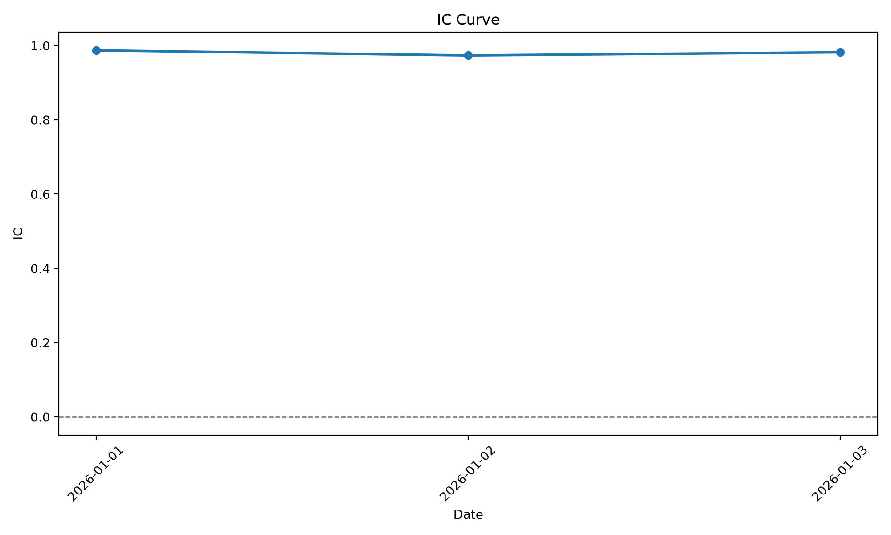
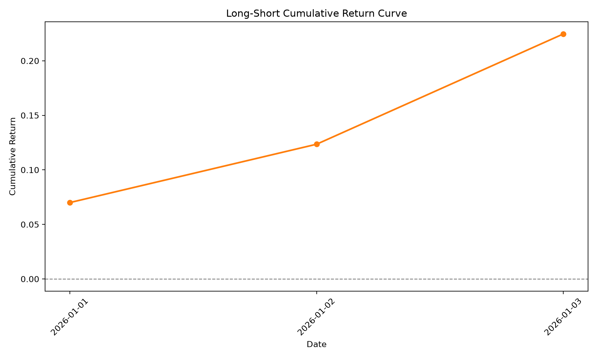

# Factor Research Report

## 1. Performance Summary

| Metric | Value |
| --- | ---: |
| IC Mean | 0.9809 |
| Rank IC Mean | 1.0 |
| ICIR | 144.0734 |
| Sharpe Ratio | 55.5608 |
| Max Drawdown | 0.0 |
| Win Rate | 1.0 |

## 2. Return Analysis

| Metric | Value |
| --- | ---: |
| Top Group Return | 0.05 |
| Bottom Group Return | -0.02 |
| Long Short Return | 0.07 |

## 3. Factor Quality

Strong factor with positive predictive ability.

## 4. Visualization

