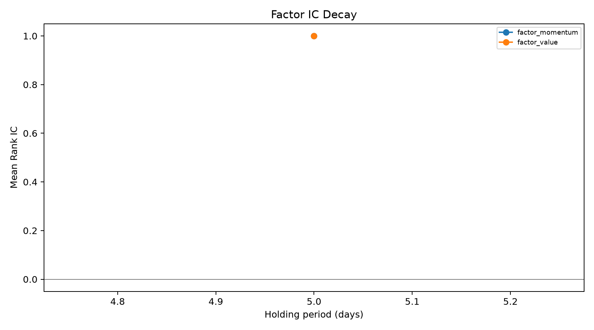
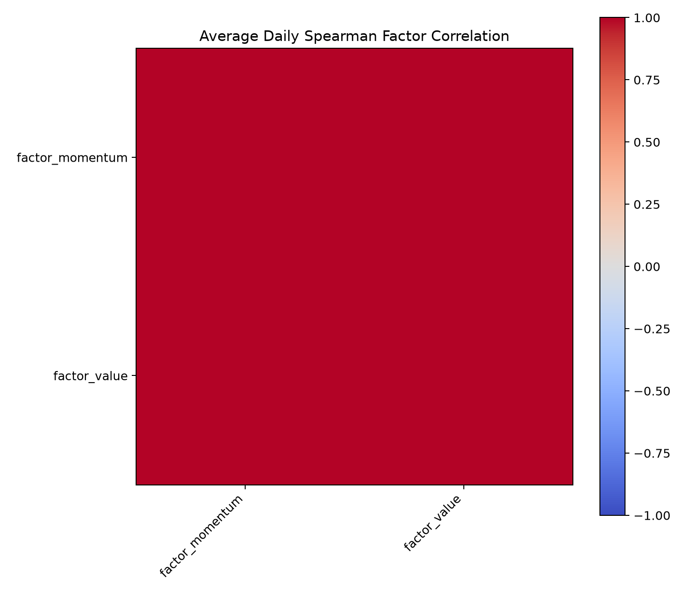

# Factor Research V2 Report

## 1. Research universe

All stocks present in the input on each trading date; this is a data-defined universe and may carry survivorship bias.

## 2. Factor definitions

- factor_momentum
- factor_value

## 3. Preprocessing method

Daily, per-factor percentile winsorization at 1%/99%, followed by direction alignment.

## 4. Normalization method

`cross_sectional_zscore`. Statistics use only the same-date stock cross-section.

## 5. IC / Rank IC summary

| factor_name     |   period |   mean_ic |   mean_rank_ic |     ic_std |   rank_ic_std |     icir |   rank_icir |   positive_ic_ratio |   t_stat |   p_value |   observations |
|:----------------|---------:|----------:|---------------:|-----------:|--------------:|---------:|------------:|--------------------:|---------:|----------:|---------------:|
| factor_momentum |        5 |  0.98095  |              1 | 0.00680868 |             0 | 144.073  |           0 |                   1 |  249.542 |         0 |              3 |
| factor_value    |        5 |  0.981849 |              1 | 0.0168728  |             0 |  58.1912 |           0 |                   1 |  100.79  |         0 |              3 |

## 6. IC significance

The table reports conventional t-statistics and normal-approximation two-sided p-values. Newey-West HAC is not applied.

## 7. IC decay

## 8. Quantile returns

|                 |   Q1 |    Q2 |   Q3 |   Q4 |   Q5 |   Q5-Q1 |
|:----------------|-----:|------:|-----:|-----:|-----:|--------:|
| factor_momentum |  nan | -0.02 |  nan | 0.02 | 0.05 |     nan |
| factor_value    |  nan | -0.02 |  nan | 0.02 | 0.03 |     nan |

## 9. Q5-Q1 spread

Q5 is the high/desirable factor group after direction alignment. The table and factor-specific charts report Q5 minus Q1.

## 10. Factor correlation

Potential redundant factors (absolute mean daily Spearman correlation above 0.8):

| factor_1        | factor_2     |   correlation |
|:----------------|:-------------|--------------:|
| factor_momentum | factor_value |             1 |

## 11. Composite score method

Baseline static category weights are technical 0.4, value 0.3, and quality 0.3. Static weights are normalized by the sum of absolute weights; equal weighting is also supported.

## 12. Limitations

- The CSV fallback may contain only a 5-day forward return, so unavailable horizons are omitted.
- The input universe is not yet point-in-time constituent data and may have survivorship bias.
- Industry/size neutralization, trading suspensions, limit-up/down constraints, and HAC inference remain future work.
