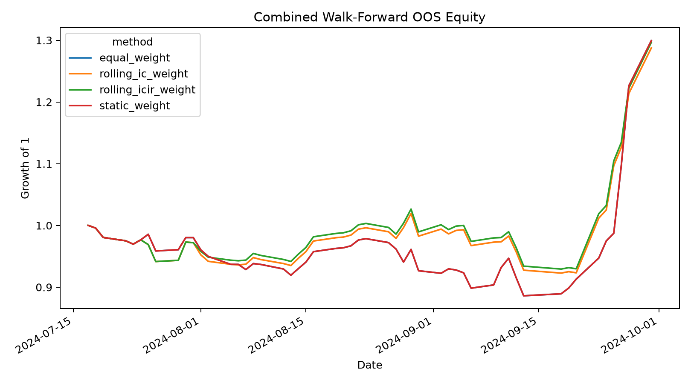

# Factor Research V3 Report

> **Research validity status: ENGINEERING_SMOKE_TEST**  
> Median daily cross-section: 3. Results below 30 stocks are engineering smoke-test output, not investment conclusions.

## 1. Universe construction

The universe is reconstructed on every factor date from stocks actually present in the input history. Minimum trading history: 120 observations. Missing close/volume and zero-volume observations are excluded; optional ADV20 is None.

## 2. Survivorship-bias handling

Stocks cannot enter before their first input observation and eligibility changes over time. Historical index constituents are not available, so survivorship bias is reduced but **not fully eliminated**. Data quality: `{'point_in_time_index_constituents': False, 'st_filter_available': True, 'suspension_flag_available': True, 'limit_status_available': True, 'amount_available': True}`.

## 3. Fundamental point-in-time handling

ROE uses announcement-date as-of alignment where `NOTICE_DATE` exists. Mock or sources without announcement dates are marked `point_in_time_available=False`; they must not be described as PIT-clean.

## 4. Neutralization methodology

Daily OLS residual: `factor = alpha + beta * log(market_cap) + industry dummies + epsilon`. Dummy encoding drops the first category. Missing exposures and insufficient samples explicitly fall back. Status counts: `{'insufficient_sample_fallback': 2736}`.

Exposure-reduction diagnostics:

| factor_name   |   before_size_corr |   after_size_corr |   before_industry_R2 |   after_industry_R2 |
|:--------------|-------------------:|------------------:|---------------------:|--------------------:|
| momentum      |                nan |               nan |                  nan |                 nan |
| volatility    |                nan |               nan |                  nan |                 nan |
| volume_factor |                nan |               nan |                  nan |                 nan |

Pre-neutralization IC:

| factor_name   |   period |    mean_ic |   mean_rank_ic |   ic_std |   rank_ic_std |       icir |   rank_icir |   positive_ic_ratio |    t_stat |     p_value |   observations |
|:--------------|---------:|-----------:|---------------:|---------:|--------------:|-----------:|------------:|--------------------:|----------:|------------:|---------------:|
| momentum      |        1 | -0.0110869 |     -0.0246711 | 0.722375 |      0.717681 | -0.0153478 |  -0.0343761 |            0.486842 | -0.267598 | 0.789009    |            304 |
| momentum      |        5 |  0.0145307 |      0.0279605 | 0.721097 |      0.71756  |  0.0201509 |   0.0389661 |            0.516447 |  0.351343 | 0.725331    |            304 |
| momentum      |       10 |  0.096071  |      0.0953947 | 0.722179 |      0.737343 |  0.133029  |   0.129376  |            0.555921 |  2.31945  | 0.0203708   |            304 |
| momentum      |       20 |  0.251542  |      0.180921  | 0.649716 |      0.663895 |  0.387157  |   0.272514  |            0.644737 |  6.75032  | 1.47522e-11 |            304 |
| momentum      |       40 |  0.312807  |      0.345395  | 0.621183 |      0.635146 |  0.503566  |   0.543803  |            0.694079 |  8.77998  | 0           |            304 |
| volatility    |        1 |  0.0694074 |      0.0789474 | 0.692221 |      0.687237 |  0.100268  |   0.114876  |            0.5625   |  1.74823  | 0.0804246   |            304 |
| volatility    |        5 |  0.0199281 |      0.0246711 | 0.685116 |      0.685938 |  0.0290871 |   0.0359669 |            0.503289 |  0.507152 | 0.612048    |            304 |
| volatility    |       10 |  0.0106463 |     -0.0378289 | 0.69784  |      0.685337 |  0.015256  |  -0.0551976 |            0.529605 |  0.265998 | 0.790241    |            304 |
| volatility    |       20 | -0.103106  |     -0.134868  | 0.625471 |      0.629239 | -0.164846  |  -0.214336  |            0.417763 | -2.87418  | 0.00405078  |            304 |
| volatility    |       40 | -0.0912859 |     -0.120066  | 0.607394 |      0.634195 | -0.150291  |  -0.18932   |            0.460526 | -2.62041  | 0.0087823   |            304 |
| volume_factor |        1 |  0.0757441 |      0.0756579 | 0.712957 |      0.69477  |  0.106239  |   0.108896  |            0.559211 |  1.85235  | 0.0639759   |            304 |
| volume_factor |        5 | -0.0419845 |     -0.0575658 | 0.689639 |      0.712321 | -0.060879  |  -0.0808144 |            0.473684 | -1.06146  | 0.28848     |            304 |
| volume_factor |       10 | -0.0243075 |     -0.0296053 | 0.707099 |      0.708817 | -0.0343763 |  -0.0417672 |            0.480263 | -0.599372 | 0.548925    |            304 |
| volume_factor |       20 | -0.0330403 |     -0.0328947 | 0.717459 |      0.70517  | -0.0460519 |  -0.046648  |            0.463816 | -0.802942 | 0.422008    |            304 |
| volume_factor |       40 | -0.0613308 |     -0.0394737 | 0.668651 |      0.672482 | -0.0917232 |  -0.0586985 |            0.460526 | -1.59925  | 0.109765    |            304 |

Post-neutralization IC:

| factor_name   |   period |    mean_ic |   mean_rank_ic |   ic_std |   rank_ic_std |       icir |   rank_icir |   positive_ic_ratio |    t_stat |     p_value |   observations |
|:--------------|---------:|-----------:|---------------:|---------:|--------------:|-----------:|------------:|--------------------:|----------:|------------:|---------------:|
| momentum      |        1 | -0.0110869 |     -0.0246711 | 0.722375 |      0.717681 | -0.0153478 |  -0.0343761 |            0.486842 | -0.267598 | 0.789009    |            304 |
| momentum      |        5 |  0.0145307 |      0.0279605 | 0.721097 |      0.71756  |  0.0201509 |   0.0389661 |            0.516447 |  0.351343 | 0.725331    |            304 |
| momentum      |       10 |  0.096071  |      0.0953947 | 0.722179 |      0.737343 |  0.133029  |   0.129376  |            0.555921 |  2.31945  | 0.0203708   |            304 |
| momentum      |       20 |  0.251542  |      0.180921  | 0.649716 |      0.663895 |  0.387157  |   0.272514  |            0.644737 |  6.75032  | 1.47522e-11 |            304 |
| momentum      |       40 |  0.312807  |      0.345395  | 0.621183 |      0.635146 |  0.503566  |   0.543803  |            0.694079 |  8.77998  | 0           |            304 |
| volatility    |        1 |  0.0694074 |      0.0789474 | 0.692221 |      0.687237 |  0.100268  |   0.114876  |            0.5625   |  1.74823  | 0.0804246   |            304 |
| volatility    |        5 |  0.0199281 |      0.0246711 | 0.685116 |      0.685938 |  0.0290871 |   0.0359669 |            0.503289 |  0.507152 | 0.612048    |            304 |
| volatility    |       10 |  0.0106463 |     -0.0378289 | 0.69784  |      0.685337 |  0.015256  |  -0.0551976 |            0.529605 |  0.265998 | 0.790241    |            304 |
| volatility    |       20 | -0.103106  |     -0.134868  | 0.625471 |      0.629239 | -0.164846  |  -0.214336  |            0.417763 | -2.87418  | 0.00405078  |            304 |
| volatility    |       40 | -0.0912859 |     -0.120066  | 0.607394 |      0.634195 | -0.150291  |  -0.18932   |            0.460526 | -2.62041  | 0.0087823   |            304 |
| volume_factor |        1 |  0.0757441 |      0.0756579 | 0.712957 |      0.69477  |  0.106239  |   0.108896  |            0.559211 |  1.85235  | 0.0639759   |            304 |
| volume_factor |        5 | -0.0419845 |     -0.0575658 | 0.689639 |      0.712321 | -0.060879  |  -0.0808144 |            0.473684 | -1.06146  | 0.28848     |            304 |
| volume_factor |       10 | -0.0243075 |     -0.0296053 | 0.707099 |      0.708817 | -0.0343763 |  -0.0417672 |            0.480263 | -0.599372 | 0.548925    |            304 |
| volume_factor |       20 | -0.0330403 |     -0.0328947 | 0.717459 |      0.70517  | -0.0460519 |  -0.046648  |            0.463816 | -0.802942 | 0.422008    |            304 |
| volume_factor |       40 | -0.0613308 |     -0.0394737 | 0.668651 |      0.672482 | -0.0917232 |  -0.0586985 |            0.460526 | -1.59925  | 0.109765    |            304 |

Pre-neutralization mean Spearman correlation:

| factor_name   |   momentum |   volatility |   volume_factor |
|:--------------|-----------:|-------------:|----------------:|
| momentum      |  1         |    0.0493421 |      -0.159539  |
| volatility    |  0.0493421 |    1         |       0.0657895 |
| volume_factor | -0.159539  |    0.0657895 |       1         |

Post-neutralization mean Spearman correlation:

| factor_name   |   momentum |   volatility |   volume_factor |
|:--------------|-----------:|-------------:|----------------:|
| momentum      |  1         |    0.0493421 |      -0.159539  |
| volatility    |  0.0493421 |    1         |       0.0657895 |
| volume_factor | -0.159539  |    0.0657895 |       1         |

## 5. Rolling factor weighting

Rolling IC/ICIR estimators shift daily IC by one trading day before rolling. Insufficient history falls back to equal weight.

## 6. Walk-forward design

Mode: rolling; train window: 756; test window: 126; minimum training history: 252. Train ends strictly before test begins and fold weights remain fixed during each test block.

Fold-level IS and OOS metrics:

|   fold | method              | train_start         | train_end           | test_start          | test_end            |   is_annualized_return |   is_volatility |   is_sharpe |   is_max_drawdown |   is_information_ratio |   is_turnover |   is_transaction_cost |   is_benchmark_excess_return |   annualized_return |   volatility |   sharpe |   max_drawdown |   information_ratio |   turnover |   transaction_cost |   benchmark_excess_return |
|-------:|:--------------------|:--------------------|:--------------------|:--------------------|:--------------------|-----------------------:|----------------:|------------:|------------------:|-----------------------:|--------------:|----------------------:|-----------------------------:|--------------------:|-------------:|---------:|---------------:|--------------------:|-----------:|-------------------:|--------------------------:|
|      0 | equal_weight        | 2023-07-04 00:00:00 | 2024-07-16 00:00:00 | 2024-07-17 00:00:00 | 2024-09-30 00:00:00 |             -0.0980484 |        0.256068 |   -0.382901 |         -0.296016 |              0.0772074 |            64 |                 0.064 |                    0.0133516 |             2.55858 |     0.450663 |  5.67738 |     -0.114022  |           -0.954161 |         20 |              0.02  |                -0.0474492 |
|      0 | static_weight       | 2023-07-04 00:00:00 | 2024-07-16 00:00:00 | 2024-07-17 00:00:00 | 2024-09-30 00:00:00 |             -0.0980484 |        0.256068 |   -0.382901 |         -0.296016 |              0.0772074 |            64 |                 0.064 |                    0.0133516 |             2.55858 |     0.450663 |  5.67738 |     -0.114022  |           -0.954161 |         20 |              0.02  |                -0.0474492 |
|      0 | rolling_ic_weight   | 2023-07-04 00:00:00 | 2024-07-16 00:00:00 | 2024-07-17 00:00:00 | 2024-09-30 00:00:00 |             -0.119543  |        0.224379 |   -0.532775 |         -0.286769 |             -0.113266  |            63 |                 0.063 |                   -0.0178182 |             2.40255 |     0.397735 |  6.04058 |     -0.0946568 |           -1.47109  |         16 |              0.016 |                -0.0609184 |
|      0 | rolling_icir_weight | 2023-07-04 00:00:00 | 2024-07-16 00:00:00 | 2024-07-17 00:00:00 | 2024-09-30 00:00:00 |             -0.119543  |        0.224379 |   -0.532775 |         -0.286769 |             -0.113266  |            63 |                 0.063 |                   -0.0178182 |             2.52075 |     0.395874 |  6.36755 |     -0.0946568 |           -1.31029  |         14 |              0.014 |                -0.0539871 |

## 7. IS vs OOS comparison

Training data estimates weights only. The strategy table below is combined OOS performance; no test-period outcome is used for its fold parameters.

## 8. Strategy comparison

| method              |   annualized_return |   volatility |   sharpe |   max_drawdown |   information_ratio |   turnover |   transaction_cost |   benchmark_excess_return |
|:--------------------|--------------------:|-------------:|---------:|---------------:|--------------------:|-----------:|-------------------:|--------------------------:|
| equal_weight        |             2.55858 |     0.450663 |  5.67738 |     -0.114022  |           -0.954161 |         20 |              0.02  |                -0.0474492 |
| static_weight       |             2.55858 |     0.450663 |  5.67738 |     -0.114022  |           -0.954161 |         20 |              0.02  |                -0.0474492 |
| rolling_ic_weight   |             2.40255 |     0.397735 |  6.04058 |     -0.0946568 |           -1.47109  |         16 |              0.016 |                -0.0609184 |
| rolling_icir_weight |             2.52075 |     0.395874 |  6.36755 |     -0.0946568 |           -1.31029  |         14 |              0.014 |                -0.0539871 |

## 9. Trading constraints

Zero volume and explicit suspension flags are excluded when available. ST and limit-up/limit-down constraints are applied only when trustworthy fields exist; the current local CSV lacks these fields, so they are reported rather than inferred.

## 10. Remaining limitations

- No reliable point-in-time CSI 300/CSI 500 constituent history.
- Current local CSV lacks industry, market capitalization, ST, explicit suspension, and price-limit flags.
- Financial mock data has no real announcement dates.
- Walk-forward results on a three-stock local sample are smoke-test evidence, not investable evidence.
- All fallbacks are recorded in `research_data_quality.json`: `['listing_date_inferred_from_first_observation', 'amount_approximated', 'st_history_unavailable', 'explicit_suspension_status_unavailable', 'limit_price_approximated', 'ipo_limit_rules_unavailable', 'market_cap_unavailable', 'industry_unavailable']`.
